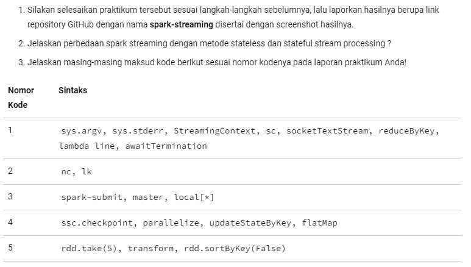

<h1>Soal</h1>

 
<h1>Jawaban</h1>
<b>2 Berikut Perbedaanya</b>
<ul>
  <li>Stateful Stream Processing berkaitan dengan keadaan keseluruhan data , sedangkan Stateless Stream Processing tidak.</ol>
  <li>Informasi tentang kejadian sebelumnya digunakan sebagai bagian dari analisis kejadian saat ini dalam konteks Stateful Stream Processing. Pembacaan suhu dari mesin industri, misalnya, lebih berharga jika dilihat secara agregat dan lintas waktu, memungkinkan tren untuk diidentifikasi saat muncul.</ol>
  <li>Data dievaluasi begitu tiba di Stateless Stream Processing, tanpa mempertimbangkan keadaan atau pengetahuan sebelumnya . Sistem Pemrosesan Aliran Tanpa Negara akan cukup jika yang Anda butuhkan hanyalah umpan waktu nyata dari suhu lingkungan tanpa mempedulikan bagaimana perubahannya. Di sisi lain, sistem Pemrosesan Arus Berstatus diperlukan jika Anda ingin memperkirakan suhu di masa mendatang berdasarkan perubahan suhu dari waktu ke waktu</ol>
</ul>
<b>3 Berikut Penjelasanya</b>
<ol>
  <li>
    <ul>
      <li>sys.argv: adalah daftar argumen baris perintah yang diberikan ke aplikasi Spark Streaming. Argumen pertama adalah nama aplikasi, dan argumen yang tersisa adalah opsi untuk aplikasi.</li>
      <li>sys.stderr: adalah aliran yang dapat digunakan untuk menulis pesan kesalahan ke konsol</li>
      <li>StreamingContext: adalah kelas yang mewakili aplikasi Spark Streaming. Ini digunakan untuk membuat dan mengelola pekerjaan streaming</li>
      <li>sc: adalah variabel yang mengacu pada objek SparkContext. Objek SparkContext digunakan untuk membuat dan mengelola pekerjaan Spark.</li>
      <li>socketTextStream: adalah metode yang membuat dataset streaming dari soket. Metode socketTextStream mengambil dua argumen: nama host atau alamat IP soket, dan nomor port soket</li>
      <li>reduceByKey: adalah fungsi yang mengurangi dataset dengan mengelompokkan elemen dengan kunci yang sama dan menerapkan fungsi ke grup. Fungsi reduceByKey mengambil dua argumen: fungsi yang mengambil dua elemen dengan kunci yang sama dan mengembalikan elemen baru, dan pembagi yang membagi dataset menjadi grup.</li>
      <li>lambda line: adalah fungsi anonim yang mengambil baris teks sebagai input dan mengembalikan jumlah kata dalam baris. Fungsi lambda line digunakan untuk menghitung jumlah kata dalam aliran teks.</li>
      <li>awaitTermination: adalah metode yang menunggu pekerjaan streaming untuk dihentikan. Metode awaitTermination mengambil dua argumen: batas waktu, dalam milisecond, dan fungsi yang dipanggil saat pekerjaan dihentikan</li>
    </ul>
  </li>
  <li>
    <ul>
      <li>nc: adalah utilitas baris perintah yang dapat digunakan untuk membuat koneksi jaringan. Perintah nc mengambil dua argumen: nama host atau alamat IP server, dan nomor port server</li>
      <li>lk: adalah fungsi Spark Streaming yang membaca data dari koneksi jaringan. Fungsi lk mengambil dua argumen: nama host atau alamat IP server, dan nomor port server.</li>
    </ul>
  </li>
  <li>
    <ul>
      <li>spark-submit: adalah alat baris perintah yang dapat digunakan untuk mengirim pekerjaan Spark. Perintah spark-submit mengambil sejumlah argumen, termasuk jalur ke file jar pekerjaan Spark, URL master, dan opsi untuk pekerjaan</li>
      <li>master: adalah URL dari klaster Spark yang akan dikirimkan pekerjaan. Nilai default untuk master adalah local[*], yang berarti bahwa pekerjaan akan dijalankan di mesin lokal</li>
      <li>local[*]: adalah nilai khusus untuk argumen master yang berarti bahwa pekerjaan akan dijalankan di mesin lokal menggunakan semua core yang tersedia.</li>
    </ul>
  </li>
  <li>
    <ul>
      <li>ssc.checkpoint: adalah metode yang memberi tahu Spark Streaming untuk menyimpan status pekerjaan streaming. Ini berarti Spark akan menyimpan status pekerjaan secara berkala ke disk. Jika pekerjaan gagal, Spark dapat memulai ulang pekerjaan dari status checkpoint terakhir.</li>
      <li>parallelize: adalah fungsi yang membuat dataset paralel dari koleksi. Dataset paralel adalah dataset terdistribusi yang dapat diproses oleh beberapa pekerja Spark secara paralel.</li>
      <li>updateStateByKey: adalah fungsi yang memperbarui status pasangan kunci-nilai. Status pasangan kunci-nilai adalah nilai yang terkait dengan kunci. Fungsi updateStateByKey mengambil dua argumen: fungsi yang memperbarui status pasangan kunci-nilai, dan fungsi yang membuat pasangan kunci-nilai baru jika kunci tidak ada</li>
      <li>flatMap: adalah fungsi yang meratakan dataset bersarang menjadi dataset tunggal. Fungsi flatMap mengambil fungsi yang mengambil dataset bersarang sebagai input dan mengembalikan dataset tunggal sebagai output.</li>
    </ul>
  </li>
  <li>
    <ul>
      <li>rdd.take(5): fungsi transformasi, yang berarti mengembalikan RDD baru. Fungsi transform juga merupakan fungsi transformasi, tetapi menerima RDD sebagai input dan mengembalikan RDD baru</li>
      <li>transform: merupakan fungsi transformasi, tetapi menerima RDD sebagai input dan mengembalikan RDD baru</li>
      <li>rdd.sortByKey(False): adalah fungsi transformasi yang mengurutkan RDD berdasarkan kunci dalam urutan menurun</li>
    </ul>
  </li>
</ol>
<b>4. Kode Program</b>
<ul>
  <li></li>
  <li></li>
  <li></li>
  <li></li>
</ul>
