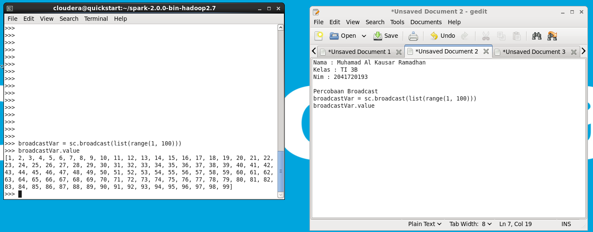

Kode program di atas menggunakan Apache Spark untuk membuat sebuah
objek broadcast variable pada RDD (Resilient Distributed Dataset) yang berisi list nilai
dari 1 hingga 99. Broadcast variable merupakan variabel yang dapat dibaca oleh semua
worker nodes pada Spark cluster, dan digunakan untuk mengirimkan nilai yang sama
ke setiap worker node secara efisien.

