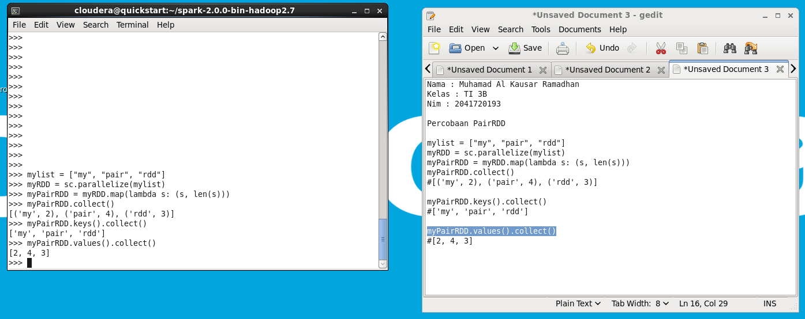

Kode program di atas adalah contoh penggunaan Apache Spark
menggunakan Python. Kode program tersebut melakukan transformasi data dari list ke
dalam RDD (Resilient Distributed Dataset), lalu melakukan mapping untuk membuat
pasangan nilai (key, value) yang terdiri dari kata dan panjang kata. Selanjutnya, kode
program tersebut mengekstrak nilai kunci dan nilai nilai dari pasangan nilai (key, value)
menggunakan method keys() dan values(), kemudian nilai-nilai tersebut dikumpulkan
dengan menggunakan method collect().

