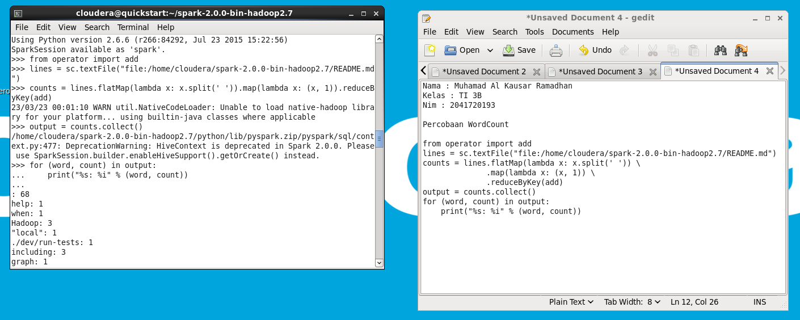

Kode program di atas adalah contoh penggunaan Apache Spark
menggunakan Python untuk menghitung jumlah kemunculan setiap kata pada sebuah
file teks (dalam contoh ini menggunakan file README.md yang ada di folder
home/cloudera/spark-2.0.0-bin-hadoop2.7). Kode program tersebut membaca file teks
dari path tertentu, melakukan transformasi data dalam RDD (Resilient Distributed
Dataset) dengan melakukan pemecahan string

