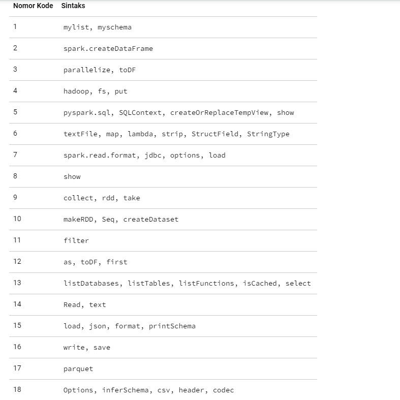

<h1>Soal Pratikum</h1>

<h1>Jawaban</h1>
<ol>
  <li>Definisi variable</li>
  <li>Membuat DataFrame dengan objek list, schema dan default data types</li>
  <li>Membuat DataFrame dengan parallelizing list dan konversi RDD ke DataFrame</li>
  <li>Mengunggah file people.txt dari path /examples/resources/people.txt ke dalam sistem file Hadoop dengan nama file people.txt</li>
  <li><b>pyspark.sql</b> adalah modul PySpark yang digunakan untuk melakukan pemrosesan data dengan menggunakan SQL. <b>SQLContext</b> adalah objek yang menyediakan antarmuka untuk berinteraksi dengan data yang disimpan dalam Spark. <b>createOrReplaceTempView</b> adalah metode PySpark yang digunakan untuk membuat tampilan sementara dataframe sebagai tabel di Spark SQL. <b>Show</b> adalah metode PySpark yang digunakan untuk menampilkan isi dataframe.</li>
  <li><b>TextFile</b> adalah metode SparkSQL yang digunakan untuk membaca file teks dan membuat RDD (Resilient Distributed Dataset) dari data yang ada di dalamnya. <b>Map</b> adalah metode PySpark yang digunakan untuk menerapkan fungsi pada setiap elemen dalam RDD. Lambda adalah fungsi anonim dalam Python yang digunakan untuk membuat fungsi sederhana tanpa nama. <b>Strip</b> adalah metode Python yang digunakan untuk menghapus karakter whitespace dari awal dan akhir sebuah string. <b>StructField</b> adalah kelas PySpark yang digunakan untuk menentukan skema atau struktur dari sebuah dataframe Spark. <b>StringType</b> adalah kelas PySpark yang digunakan untuk menentukan tipe data string dalam dataframe Spark</li>
  <li><b>spark.read.format</b> adalah metode PySpark yang digunakan untuk membaca data dari sumber eksternal ke dalam dataframe Spark dengan format tertentu. <b>jdbc</b> adalah nama format yang digunakan untuk membaca data dari database relasional menggunakan JDBC (Java Database Connectivity) dalam Spark. <b>options</b> adalah argumen tambahan yang digunakan untuk memberikan informasi tambahan tentang sumber data yang dibaca. <b>load</b> adalah metode PySpark yang digunakan untuk memuat data dari sumber eksternal ke dalam dataframe Spark.</li>
  <li>Menampilkan data yang sudah dibaca menggunakan jdbc</li>
  <li><b>collect</b> adalah metode PySpark yang digunakan untuk mengembalikan seluruh elemen RDD dari executor ke driver program PySpark. <b>rdd</b> adalah atribut dari dataframe Spark yang digunakan untuk mengonversi dataframe menjadi RDD. <b>take</b> adalah metode PySpark yang digunakan untuk mengambil sejumlah elemen tertentu dari RDD dan mengembalikannya ke driver program PySpark. </li>
  <li><b>makeRDD</b> adalah metode PySpark yang digunakan untuk membuat RDD dari sebuah sequence atau kumpulan data dalam PySpark. <b>Seq</b> adalah tipe data di Scala untuk merepresentasikan sequence atau kumpulan data dalam PySpark. <b>createDataset</b> adalah metode PySpark yang digunakan untuk membuat Dataset dari sebuah sequence atau kumpulan data dalam PySpark. </li>
  <li>Melakukan Filtering pada data frame</li>
  <li><b>as</b> adalah metode PySpark yang digunakan untuk memberikan alias pada kolom-kolom dataframe. <b>toDF</b> adalah metode PySpark yang digunakan untuk mengubah RDD menjadi dataframe. <b>first</b> adalah metode PySpark yang digunakan untuk mengambil nilai pertama dari RDD atau dataframe. </li>
  <li><b>listDatabases</b> adalah metode PySpark yang digunakan untuk menampilkan daftar database Spark yang tersedia. <b>listTables</b> adalah metode PySpark yang digunakan untuk menampilkan daftar tabel yang tersedia dalam database Spark. <b>listFunctions</b> adalah metode PySpark yang digunakan untuk menampilkan daftar fungsi yang tersedia dalam SparkSQL. <b>isCached</b> adalah metode PySpark yang digunakan untuk mengecek apakah sebuah tabel sudah di-cache atau belum. <b>select</b> adalah metode PySpark yang digunakan untuk melakukan query data dari tabel. </li>
  <li></li>
  <li></li>
  <li></li>
  <li></li>
  <li></li>
</ol>
